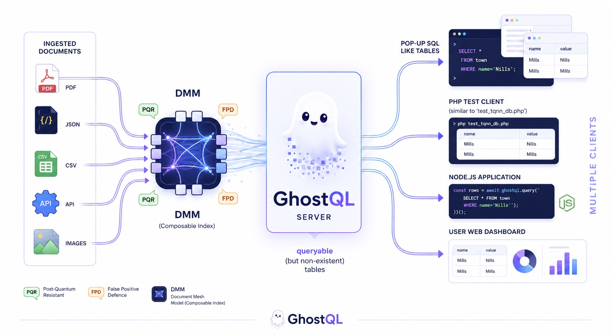

## GhostQL

<div align="center">

  <h3>A composable query engine for unstructured data.</h3>

  <p>
    GhostQL lets developers write familiar SQL-style queries against associative memory backends —
    including <a href="https://toridion.com">Toridion DMM</a> and Docling ingest pipelines —
    without schemas, migrations, or table management.<br>
    Tables appear when you need them. Gone when you don't.
  </p>

  <p>
    <a href="https://github.com/toridion/ghostql/blob/main/LICENSE"></a>
    <a href="https://www.python.org/downloads/"></a>
    
    
  </p>
</div>

---

## What is GhostQL?

Traditional databases store data in tables with fixed schemas. If your data changes shape — or you're querying millions of unstructured records from Docling, FHIR pipelines, or document ingest systems — you spend more time managing the database than using it.

GhostQL takes a different approach. It translates SQL-like queries into calls against associative memory backends, where documents are retrieved by content rather than by row location. There's no schema to define, no table to create, no migration to run when your data evolves.

You write a query. GhostQL builds the table from the data that matches. When the query is done, so is the table.

```sql
-- Query millions of unstructured health records in milliseconds
SELECT document FROM records
  WHERE name='Mills' AND nhs='4855805912'
  WITH PQR FPD
```

---

## Features

- **SQL-style queries** — `SELECT`, `WHERE`, `AND`, `LIKE`, `JOIN` — no new syntax to learn
- **LIKE similarity search** — tokenised fuzzy matching with configurable overlap threshold
- **JOIN across result sets** — content-addressed in-memory join, no foreign keys required
- **PQR hashing** — self-salting SHA-256 post-quantum resistant token hashing
- **FPD** — False Positive Defence: forward × reversed-input hash intersection
- **Pluggable connector architecture** — swap backends without changing query code
- **Toridion DMM connector** included — reference implementation and production-ready
- **Secure config** — credentials in `ghostql.conf`, never in code
- **PHP + Python example clients** included
- **MIT licensed** — use it, fork it, build on it

---

## Quick start

### 1. Install

```bash
git clone https://github.com/toridion/ghostql
cd ghostql
pip install -e .
```

### 2. Configure

```bash
cp ghostql.conf.example ghostql.conf
# Edit ghostql.conf with your DMM credentials and a strong server password
```

```ini
[server]
password = your_strong_password

[dmm]
api_url    = https://your-dmm-host/v1/document/search/searchDoc.php
api_key    = YOUR_DMM_API_KEY
api_secret = YOUR_DMM_API_SECRET
dataset    = your_dataset
```

### 3. Start the server

```bash
python -m ghostql.server
# or: ghostql  (after pip install)
```

### 4. Run a query

```bash
# PHP
php examples/query_ghostql.php

# Python
python examples/query_ghostql.py
```

---

## Query language

### Exact match

```sql
SELECT document FROM records WHERE name='Mills' WITH PQR FPD
```

### Multi-condition AND

```sql
SELECT document FROM records
  WHERE name='Mills' AND nhs='4855805912'
  WITH PQR FPD
```

### LIKE — similarity search

```sql
SELECT document FROM records
  WHERE notes LIKE 'Mills diabetes insulin pump annual review'
  WITH PQR FPD
```

Results include `overlap_pct` — how many query tokens the document matched.

### JOIN

```sql
SELECT document FROM patients
  JOIN prescriptions ON nhs_number
  WHERE name='Mills'
  WITH PQR FPD
```

Returns documents present in both result sets.

### Flags

| Flag | Meaning |
|------|---------|
| `WITH PQR` | Self-salting SHA-256 hash per token (required for PQR-ingested data) |
| `WITH PQR FPD` | PQR + False Positive Defence — forward ∩ reversed-input hash |

Full reference: [`docs/query-language.md`](docs/query-language.md)

---

## Architecture

```
ghostql/
├── core/
│   ├── config.py          Secure config loader (INI + env vars)
│   └── logging_setup.py   Centralised logging
├── connectors/
│   ├── base.py            BaseConnector abstract class — the drop-in contract
│   ├── __init__.py        Connector auto-loader
│   └── dmm.py             Toridion DMM reference connector
└── query/
    ├── parser.py          SQL-like syntax → structured dict
    ├── select.py          WHERE equality executor
    ├── like.py            LIKE similarity executor
    ├── join.py            JOIN executor
    ├── pqr.py             Self-salting PQR hashing
    ├── tokeniser.py       Stopword-filtered tokeniser
    └── __init__.py        Query dispatcher
```

The connector and query layers are fully decoupled. Connectors know nothing about hashing or query logic. Query modules know nothing about the backend. This separation is intentional — it's what makes GhostQL composable.

---

## Building a custom connector

Connect GhostQL to any backend by subclassing `BaseConnector`:

```python
from ghostql.connectors.base import BaseConnector, ConnectorResult

class MyConnector(BaseConnector):

    def search(self, pattern: str, dataset: str = '') -> ConnectorResult:
        results = my_backend.lookup(pattern)
        return ConnectorResult(success=bool(results), fileset=set(results))

    def store(self, filereference: str, pattern: str, dataset: str = '') -> dict:
        ok = my_backend.put(filereference, pattern)
        return {'success': ok, 'response': 'OK' if ok else 'ERROR'}

    def ping(self) -> bool:
        return my_backend.is_alive()
```

Then in `ghostql.conf`:

```ini
[connector]
type = my_package.my_module:MyConnector
```

Full guide: [`docs/connectors.md`](docs/connectors.md)

---

## What is Toridion DMM?

[Toridion DMM](https://toridion.com) (Distributed Memory Module) is a sovereign AI infrastructure platform built on TQNN associative memory technology. It provides O(1) content-addressable retrieval across millions of unstructured records — no embeddings, no vector indices, no GPU required.

GhostQL is the query layer that sits in front of DMM. It's also designed to work with any other associative memory or document retrieval backend you want to connect.

Learn more at [toridion.com](https://toridion.com) · [Lindisfarne M1 dataset on Hugging Face](https://huggingface.co/datasets/Toridion/lindisfarne-m1)

---

## Contributing

Contributions are welcome — connectors, query types, docs, examples.

See [`CONTRIBUTING.md`](CONTRIBUTING.md) for the full guide.

Ideas particularly welcome:
- Redis connector
- Weaviate / Milvus vector store connector
- Filesystem / Docling direct connector
- Native Python client library (no raw TCP)
- `GROUP BY` aggregation support

---

## Licence

MIT — see [`LICENSE`](LICENSE)

---

<div align="center">
  <br>
  <sub>Built with ♥ by <a href="https://toridion.com">Toridion Ltd</a> · Scarborough, North Yorkshire</sub>
</div>
